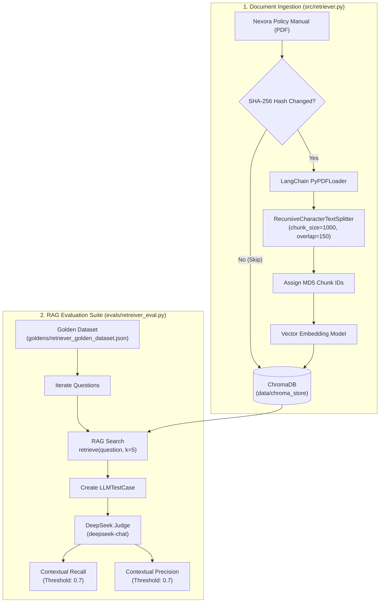

# RAG Evaluation Workbench

[](https://www.python.org/)
[](https://python.langchain.com/)
[](https://www.trychroma.com/)
[](https://github.com/confident-ai/deepeval)

A practical framework for evaluating and benchmarking Retrieval-Augmented Generation (RAG) pipelines using **LangChain**, **ChromaDB**, and **DeepEval** with a **DeepSeek** LLM Judge.

---

## Overview

This repository contains a working implementation for testing and evaluating RAG pipelines. Using an automated **LLM-as-a-Judge** approach, it benchmarks performance against a reference golden dataset to ensure accurate context quality and response reliability.

---

## Current Features

- **Incremental Vector Ingestion**: SHA-256 file hashing (`ingested_files.json`) to skip unchanged PDF and TXT files during vector store updates.
- **Deterministic Chunk IDs**: MD5 hashing per document chunk to trace retrieved text back to original sources.
- **Golden Dataset Testing**: Standardized dataset (`goldens/retriever_golden_dataset.json`) containing questions, expected answers, and source section references.
- **LLM-as-a-Judge Evaluation**: Custom `DeepSeekJudge` integrating **DeepSeek-Chat** via DeepEval to grade evaluation test cases.
- **Automated Pipeline Metrics**: Contextual Recall and Contextual Precision metrics with automated reasoning.

---

## Implemented Architecture



---

## Active Metrics

### 1. Contextual Recall
Measures if the retrieved context contains all the necessary information present in the ground-truth answer (`expected_output`).

$$\text{Contextual Recall} = \frac{|\text{Attributed Statements in Expected Output}|}{|\text{Total Statements in Expected Output}|}$$

* **Configured Threshold**: `0.70`

### 2. Contextual Precision
Evaluates whether relevant context chunks are ranked higher in the top-$k$ search results compared to irrelevant chunks.

$$\text{Contextual Precision@k} = \frac{\sum_{i=1}^{k} \text{Precision@i} \times v_i}{\text{Total Relevant Items}}$$

* **Configured Threshold**: `0.70`

---

## Project Layout

```
Rag Eval Project/
├── data/
│   ├── Nexora_Company_Policy_Manual.pdf  # Document corpus
│   └── chroma_store/                     # Vector store and ingestion hashes
├── goldens/
│   └── retriever_golden_dataset.json     # Ground-truth test dataset
├── src/
│   ├── retriever.py                      # Vector ingestion, chunking, and search
│   └── garbage_testing.py                # Embedding test script
├── evals/
│   └── retreiver_eval.py                 # DeepEval test suite using DeepSeek judge
├── .env                                  # API keys
├── requirements.txt                      # Project dependencies
└── README.md
```

---

## Quickstart

### 1. Environment Setup

Create a `.env` file in the project root:

```env
GOOGLE_API_KEY=your_google_gemini_api_key
DEEPSEEK_API_KEY=your_deepseek_api_key
DEEPSEEK_EVAL_MODEL=deepseek-chat
```

### 2. Install Dependencies

```bash
pip install -r requirements.txt
```

### 3. Run Vector Ingestion

```bash
python src/retriever.py
```

### 4. Run Evaluation Suite

```bash
python evals/retreiver_eval.py
```

---

## Future Extensions (Roadmap)

Planned features for future iterations:
- Add generator response metrics (Faithfulness, Answer Relevancy).
- Add support for comparing multiple embedding models and chunking sizes.
