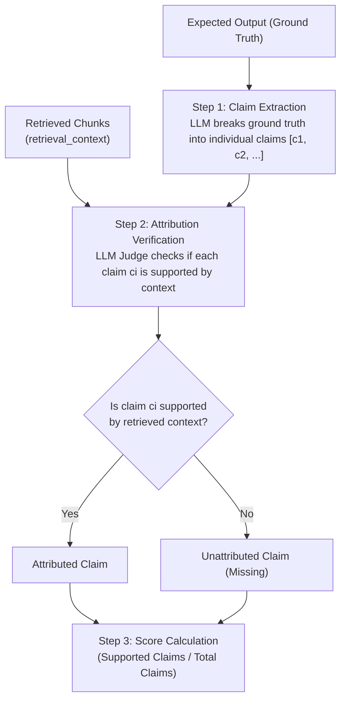
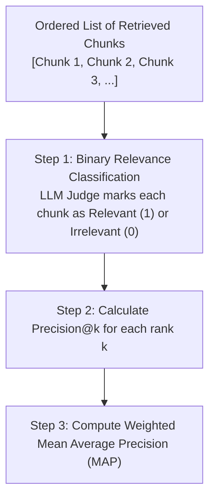
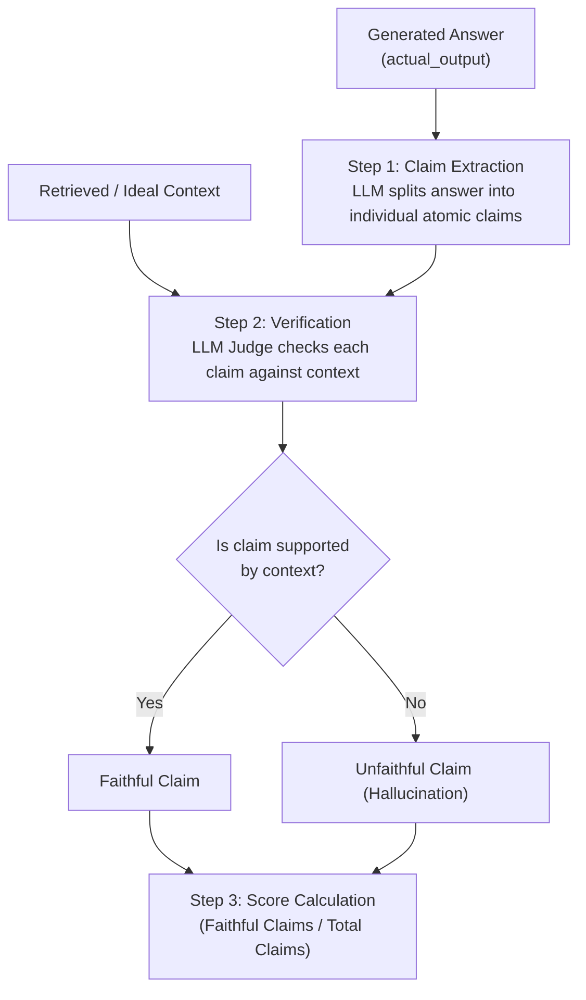
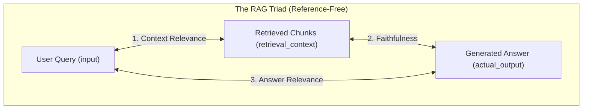
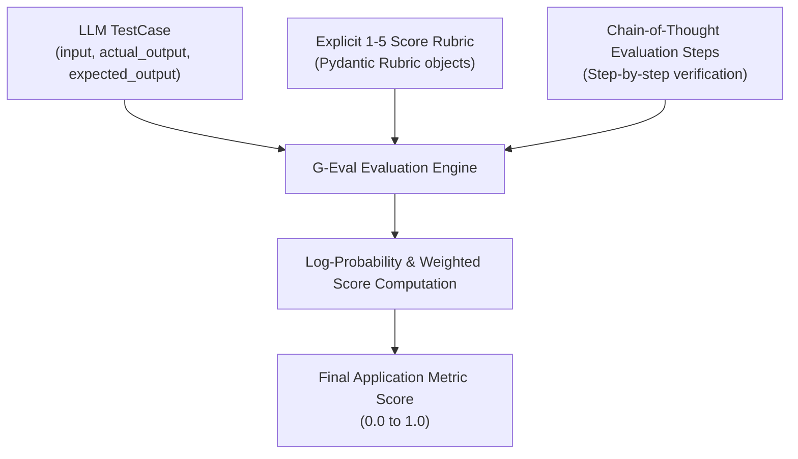

# RAG Evaluation Workbench

[](https://www.python.org/)
[](https://python.langchain.com/)
[](https://www.trychroma.com/)
[](https://github.com/confident-ai/deepeval)

A practical framework for evaluating, benchmarking, and optimizing Retrieval-Augmented Generation (RAG) pipelines across **Component Level** (Retriever & Generator in isolation), **Pipeline Level** (End-to-End RAG Triad), and **Application Level** (Business & UX G-Eval Suite).

---

## Overview

Evaluating RAG applications requires an evaluation strategy across **Retrieval Quality**, **Generation Groundedness**, and **User Experience Quality**. 

This repository serves as a modular **RAG Evaluation Laboratory**. It decouples component testing from live pipeline testing, using **DeepEval** and a **DeepSeek LLM Judge** to benchmark performance against reference golden datasets.

---

## Table of Contents

- [Overview](#overview)
- [Metric Classification: Reference-Based vs. Reference-Free](#metric-classification-reference-based-vs-reference-free)
- [Evaluation Levels & Metrics](#evaluation-levels--metrics)
- [1. Component-Level Evaluation (Isolated Testing)](#1-component-level-evaluation-isolated-testing)
  - [1.1 Contextual Recall](#11-contextual-recall-retriever-component--reference-based)
  - [1.2 Contextual Precision](#12-contextual-precision-retriever-component--reference-based)
  - [1.3 Faithfulness](#13-faithfulness-generator-component--reference-free)
  - [1.4 Answer Relevancy](#14-answer-relevancy-generator-component--reference-free)
- [2. Pipeline-Level Evaluation (The RAG Triad)](#2-pipeline-level-evaluation-the-rag-triad)
  - [2.1 Context Relevance](#21-context-relevance-contextualrelevancymetric--reference-free)
  - [2.2 Faithfulness](#22-faithfulness-faithfulnessmetric--reference-free)
  - [2.3 Answer Relevance](#23-answer-relevance-answerrelevancymetric--reference-free)
- [3. Application-Level Evaluation (G-Eval Suite)](#3-application-level-evaluation-g-eval-suite)
  - [3.1 G-Eval Correctness](#31-g-eval-correctness-correctness_geval--reference-based)
  - [3.2 G-Eval Completeness](#32-g-eval-completeness-completeness_geval--reference-based)
  - [3.3 G-Eval Style & Tone](#33-g-eval-style--tone-style_geval--reference-free)
- [Project Structure](#project-structure)
- [Quickstart Guide](#quickstart-guide)
- [Empirical Benchmark Findings](#empirical-benchmark-findings)

---

## Metric Classification: Reference-Based vs. Reference-Free

RAG evaluation metrics are classified into two major categories depending on whether they require a ground-truth reference answer (`expected_output`):

| Metric | Category | Required Inputs | Needs Ground Truth (`expected_output`)? |
| :--- | :---: | :--- | :---: |
| **Contextual Recall** | **Reference-Based** | `expected_output`, `retrieval_context` | **YES** |
| **Contextual Precision** | **Reference-Based** | `input`, `expected_output`, `retrieval_context` | **YES** |
| **Context Relevance** | **Reference-Free** | `input`, `retrieval_context` | **NO** |
| **Faithfulness** | **Reference-Free** | `actual_output`, `retrieval_context` | **NO** |
| **Answer Relevance** | **Reference-Free** | `input`, `actual_output` | **NO** |
| **G-Eval Correctness** | **Reference-Based** | `input`, `actual_output`, `expected_output` | **YES** |
| **G-Eval Completeness** | **Reference-Based** | `input`, `actual_output`, `expected_output` | **YES** |
| **G-Eval Style & Tone** | **Reference-Free** | `input`, `actual_output` | **NO** |

---

## Evaluation Levels & Metrics

```
                      ┌─────────────────────────────────────────┐
                      │        RAG EVALUATION HIERARCHY         │
                      └────────────────────┬────────────────────┘
                                           │
         ┌─────────────────────────────────┼─────────────────────────────────┐
         │                                 │                                 │
┌────────┴─────────────────┐     ┌─────────┴────────────────┐     ┌──────────┴────────────────┐
│ 1. COMPONENT-LEVEL       │     │ 2. PIPELINE-LEVEL        │     │ 3. APPLICATION-LEVEL      │
│    (Isolated Testing)    │     │    (RAG Triad)           │     │    (Business & UX Suite)  │
└────────┬─────────────────┘     └─────────┬────────────────┘     └──────────┬────────────────┘
         │                                 │                                 │
 ├── Retriever-Only               └── RAG Triad Pipeline            └── G-Eval Custom Suite
 │   ├── Contextual Recall                ├── Context Relevance              ├── Correctness
 │   └── Contextual Precision             ├── Faithfulness                   ├── Completeness
 └── Generator-Only                       └── Answer Relevance               └── Style & Tone
     ├── Faithfulness
     └── Answer Relevancy
```

---

## 1. Component-Level Evaluation (Isolated Testing)

Component-level evaluations test individual building blocks of the system to prevent error cascading.

### 1.1 Contextual Recall (Retriever Component — Reference-Based)

Measures **completeness** (information coverage) by checking whether the retrieved chunks contain all the necessary ground-truth facts.



$$\text{Contextual Recall} = \frac{\text{Number of Ground-Truth Claims Supported by Context}}{\text{Total Claims in Ground-Truth Answer}}$$

---

### 1.2 Contextual Precision (Retriever Component — Reference-Based)

Measures **ranking quality** and signal placement (evaluating whether relevant chunks are placed at positions #1, #2 versus buried under irrelevant noise).



$$\text{Contextual Precision} = \frac{\sum_{k=1}^{K} (\text{Precision@k} \times v_k)}{\text{Total Number of Relevant Chunks}}$$

---

### 1.3 Faithfulness (Generator Component — Reference-Free)

Measures **zero-hallucination** by passing context (`ideal_context` or `retrieval_context`) to the generator to verify if the answer is 100% grounded in the context.



$$\text{Faithfulness} = \frac{\text{Number of Faithful Claims in Generated Answer}}{\text{Total Claims Generated in Answer}}$$

---

### 1.4 Answer Relevancy (Generator Component — Reference-Free)

Measures whether the generated answer directly addresses the user query without off-topic tangents or non-answers.

---

## 2. Pipeline-Level Evaluation (The RAG Triad)

The **RAG Triad** evaluates the 3 essential quality edges of an end-to-end RAG pipeline ($\text{User Query} \rightarrow \text{Retriever} \rightarrow \text{Generator} \rightarrow \text{Answer}$). All 3 RAG Triad metrics are **Reference-Free**, making them ideal for production monitoring.



### 2.1 Context Relevance (`ContextualRelevancyMetric` — Reference-Free)
Measures the **signal-to-noise ratio** within retrieved context chunks relative to the user query.

$$\text{Context Relevance} = \frac{\text{Number of Relevant Claims in Retrieved Context}}{\text{Total Claims in Retrieved Context}}$$

### 2.2 Faithfulness (`FaithfulnessMetric` — Reference-Free)
Verifies that the live generated response contains zero hallucinations relative to the live retrieved context.

### 2.3 Answer Relevance (`AnswerRelevancyMetric` — Reference-Free)
Verifies that the generated response directly answers the user query without off-topic tangents.

---

## 3. Application-Level Evaluation (G-Eval Suite)

The **Application-Level Suite** evaluates subjective business requirements, user experience (UX), and brand tone using **G-Eval (GEval)** with explicit 5-tier integer score rubrics.



### 3.1 G-Eval Correctness (`correctness_geval` — Reference-Based)
Evaluates factual accuracy against `expected_output` using step-by-step verification of numbers, percentages, dates, and administrative rules.

### 3.2 G-Eval Completeness (`completeness_geval` — Reference-Based)
Evaluates multi-part query coverage, verifying that 100% of required sub-questions are answered without skipping details.

### 3.3 G-Eval Style & Tone (`style_geval` — Reference-Free)
Evaluates pedagogical communication style, polite tone, and clean Markdown formatting (bullet points, bold highlights) while avoiding robotic clichés.

---

## Project Structure

```
Rag Eval Project/
├── data/
│   ├── Nexora_Company_Policy_Manual.pdf  # Document corpus
│   └── chroma_store/                     # Vector store & ingestion logs
├── goldens/
│   ├── retriever_golden_dataset.json     # Ground-truth retriever test dataset
│   ├── faithfulness_golden_dataset.json    # Ground-truth faithfulness & generator dataset
│   └── application_golden_dataset.json   # Ground-truth application UX (Correctness, Completeness, Style) dataset
├── src/
│   ├── retriever.py                      # Vector ingestion, chunking & search
│   ├── generator.py                      # RAG answer generation module
│   └── garbage_testing.py                # Embedding test script
├── evals/
│   ├── retreiver_eval.py                 # DeepEval retriever test suite
│   ├── generator_eval.py                 # DeepEval generator test suite
│   ├── rag_triad_eval.py                 # RAG Triad end-to-end pipeline evaluation
│   └── geval_app_eval.py                 # G-Eval Application-Level (Correctness, Completeness, Style) suite
├── dump_chunks.py                        # Export all ChromaDB chunks to JSON
├── .env                                  # API keys
├── requirements.txt                      # Project dependencies
└── README.md
```

---

## Quickstart Guide

### 1. Environment Setup

Create a `.env` file in the project root:

```env
GOOGLE_API_KEY=your_google_gemini_api_key
DEEPSEEK_API_KEY=your_deepseek_api_key
DEEPSEEK_EVAL_MODEL=deepseek-chat
GROQ_API_KEY=your_groq_api_key
```

### 2. Install Dependencies

```bash
pip install -r requirements.txt
```

### 3. Ingest Data

Ingest documents into ChromaDB vector store:

```bash
python src/retriever.py
```

### 4. Run Evaluation Suites

- **Run Retriever Component Evaluation**:
  ```bash
  python evals/retreiver_eval.py
  ```

- **Run Generator Component Evaluation**:
  ```bash
  python evals/generator_eval.py
  ```

- **Run RAG Triad Pipeline Evaluation**:
  ```bash
  python evals/rag_triad_eval.py
  ```

- **Run Application-Level G-Eval Suite**:
  ```bash
  python evals/geval_app_eval.py
  ```

---

## Empirical Benchmark Findings

By evaluating the RAG pipeline empirically across Component, Pipeline, and Application levels, we observed the impact of parameter tuning and prompt engineering:

| Evaluation Tier | Metric | Score / Pass Rate | Key Insight & Tuning Impact |
| :--- | :--- | :---: | :--- |
| **Component (Retriever)** | **Contextual Recall** | **0.91 (90.0% Pass)** | High information coverage across 50 test cases. |
| **Component (Retriever)** | **Contextual Precision** | **0.84 (78.0% Pass)** | Relevant chunks ranked at top positions #1, #2. |
| **Component (Generator)** | **Faithfulness** | **1.00 (100.0% Pass)** | Perfect zero-hallucination when supplied ideal context. |
| **Component (Generator)** | **Answer Relevancy** | **0.79 (66.7% Pass)** | Generated responses address the query directly. |
| **Pipeline (Triad)** | **Context Relevance** | **0.05 $\rightarrow$ 0.40 (8x Jump)** | Tuning `chunk_size=400` & `TOP_K=2` eliminated 70%+ of fluff. |
| **Pipeline (Triad)** | **Faithfulness** | **1.00 (100.0% Pass)** | Zero-hallucination grounded generation. |
| **Pipeline (Triad)** | **Answer Relevance** | **0.98 (94.4% Pass)** | Live pipeline responses directly answer queries. |
| **Application (G-Eval)** | **Style & Tone** | **0.95 (100.0% PASS!)** | Anti-cliché & Markdown guidelines achieved 100% pass rate! |
| **Application (G-Eval)** | **Completeness** | **0.77 (68.8% Pass)** | Increasing `TOP_K=3` improved multi-part query coverage. |
| **Application (G-Eval)** | **Correctness** | **0.70 (62.5% Pass)** | Met passing threshold on 1-5 scale Rubric evaluation. |
