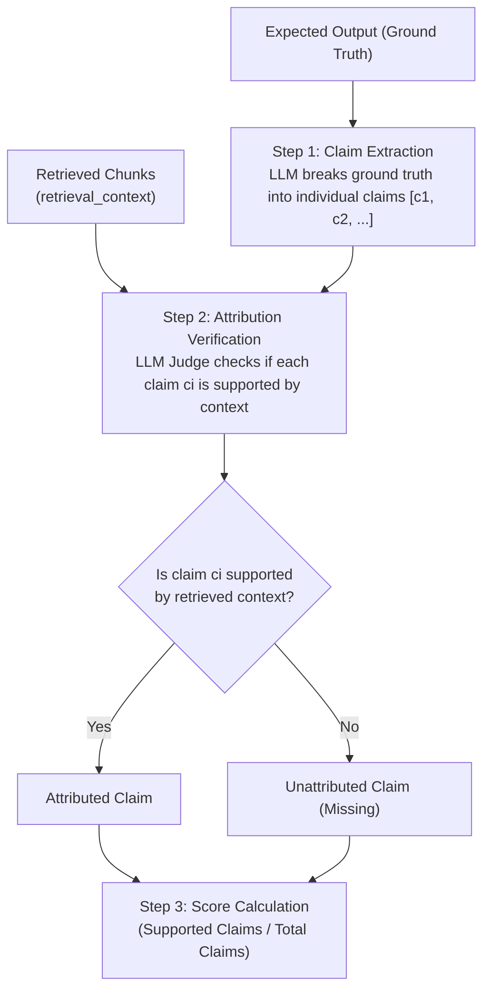
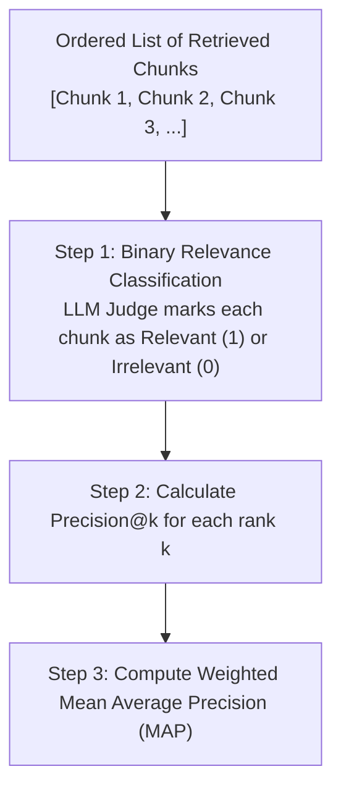
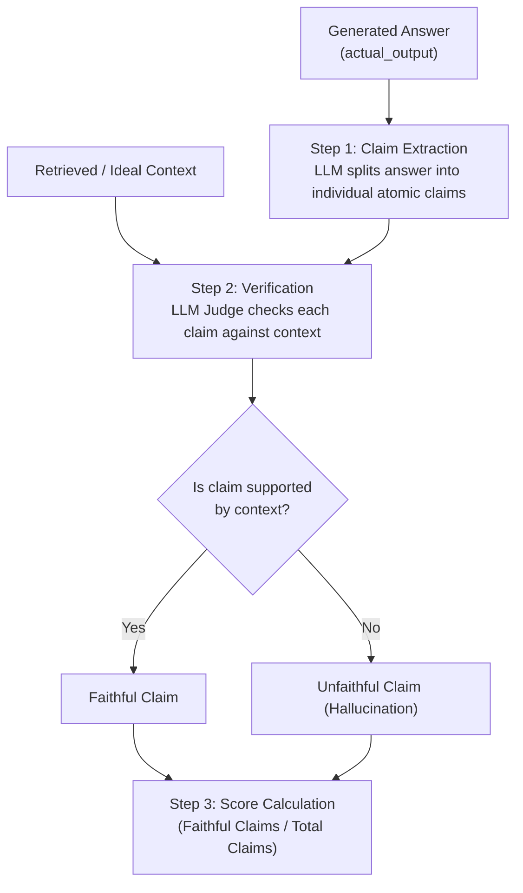
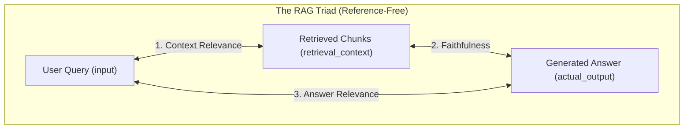

# RAG Evaluation Workbench

[](https://www.python.org/)
[](https://python.langchain.com/)
[](https://www.trychroma.com/)
[](https://github.com/confident-ai/deepeval)

A practical framework for evaluating, benchmarking, and optimizing Retrieval-Augmented Generation (RAG) pipelines at both **Component Level** (Retriever & Generator in isolation) and **Pipeline Level** (End-to-End RAG Triad).

---

## Overview

Evaluating RAG applications requires an evaluation strategy across both **Retrieval Quality** and **Generation Quality**. 

This repository serves as a modular **RAG Evaluation Laboratory**. It decouples component testing from live pipeline testing, using **DeepEval** and a **DeepSeek LLM Judge** to benchmark performance against reference golden datasets.

---

## Metric Classification: Reference-Based vs. Reference-Free

RAG evaluation metrics are classified into two major categories depending on whether they require a ground-truth reference answer (`expected_output`):

| Metric | Category | Required Inputs | Needs Ground Truth (`expected_output`)? |
| :--- | :---: | :--- | :---: |
| **Contextual Recall** | **Reference-Based** | `expected_output`, `retrieval_context` | **YES** |
| **Contextual Precision** | **Reference-Based** | `input`, `expected_output`, `retrieval_context` | **YES** |
| **Context Relevance** | **Reference-Free** | `input`, `retrieval_context` | **NO** |
| **Faithfulness** | **Reference-Free** | `actual_output`, `retrieval_context` | **NO** |
| **Answer Relevance** | **Reference-Free** | `input`, `actual_output` | **NO** |

---

## Evaluation Levels & Metrics

```
                     ┌───────────────────────────────────────────┐
                     │          RAG EVALUATION SUITE             │
                     └─────────────────────┬─────────────────────┘
                                           │
         ┌─────────────────────────────────┴─────────────────────────────────┐
         │                                                                   │
┌────────┴─────────────────┐                                       ┌─────────┴────────────────┐
│ 1. COMPONENT-LEVEL EVALS │                                       │ 2. PIPELINE-LEVEL EVALS  │
│    (Isolated Testing)    │                                       │    (End-to-End System)   │
└────────┬─────────────────┘                                       └─────────┬────────────────┘
         │                                                                   │
 ├── A. Retriever-Only                                              └── RAG Triad Pipeline
 │   ├── Contextual Recall (Reference-Based)                                ├── Context Relevance (Reference-Free)
 │   └── Contextual Precision (Reference-Based)                             ├── Faithfulness (Reference-Free)
 │                                                                          └── Answer Relevance (Reference-Free)
 └── B. Generator-Only (Fixed ground-truth context)
     ├── Faithfulness (Reference-Free)
     └── Answer Relevancy (Reference-Free)
```

---

## Component-Level Evaluation (Isolated Testing)

### 1. Contextual Recall (Retriever Component — Reference-Based)

Measures **completeness** (information coverage) by checking whether the retrieved chunks contain all the necessary ground-truth facts.



$$\text{Contextual Recall} = \frac{\text{Number of Ground-Truth Claims Supported by Context}}{\text{Total Claims in Ground-Truth Answer}}$$

---

### 2. Contextual Precision (Retriever Component — Reference-Based)

Measures **ranking quality** and signal placement (evaluating whether relevant chunks are placed at positions #1, #2 versus buried under irrelevant noise).



$$\text{Contextual Precision} = \frac{\sum_{k=1}^{K} (\text{Precision@k} \times v_k)}{\text{Total Number of Relevant Chunks}}$$

---

### 3. Faithfulness (Generator Component — Reference-Free)

Measures **zero-hallucination** by passing context (`ideal_context` or `retrieval_context`) to the generator to verify if the answer is 100% grounded in the context.



$$\text{Faithfulness} = \frac{\text{Number of Faithful Claims in Generated Answer}}{\text{Total Claims Generated in Answer}}$$

---

## Pipeline-Level Evaluation (The RAG Triad)

The **RAG Triad** evaluates the 3 essential quality edges of an end-to-end RAG pipeline ($\text{User Query} \rightarrow \text{Retriever} \rightarrow \text{Generator} \rightarrow \text{Answer}$). All 3 RAG Triad metrics are **Reference-Free**, making them ideal for production monitoring.



### 1. Context Relevance (`ContextualRelevancyMetric` — Reference-Free)
Measures the **signal-to-noise ratio** within retrieved context chunks relative to the user query.

$$\text{Context Relevance} = \frac{\text{Number of Relevant Claims in Retrieved Context}}{\text{Total Claims in Retrieved Context}}$$

### 2. Faithfulness (`FaithfulnessMetric` — Reference-Free)
Verifies that the live generated response contains zero hallucinations relative to the live retrieved context.

### 3. Answer Relevance (`AnswerRelevancyMetric` — Reference-Free)
Verifies that the generated response directly answers the user query without off-topic tangents.

---

## Project Structure

```
Rag Eval Project/
├── data/
│   ├── Nexora_Company_Policy_Manual.pdf  # Document corpus
│   └── chroma_store/                     # Vector store & ingestion logs
├── goldens/
│   ├── retriever_golden_dataset.json     # Ground-truth retriever test dataset
│   └── faithfulness_golden_dataset.json    # Ground-truth faithfulness & generator dataset
├── src/
│   ├── retriever.py                      # Vector ingestion, chunking & search
│   ├── generator.py                      # RAG answer generation module
│   └── garbage_testing.py                # Embedding test script
├── evals/
│   ├── retreiver_eval.py                 # DeepEval retriever test suite
│   ├── generator_eval.py                 # DeepEval generator test suite
│   └── rag_triad_eval.py                 # RAG Triad end-to-end pipeline evaluation
├── dump_chunks.py                        # Export all ChromaDB chunks to JSON
├── .env                                  # API keys
├── requirements.txt                      # Project dependencies
└── README.md
```

---

## Quickstart Guide

### 1. Environment Setup

Create a `.env` file in the project root:

```env
GOOGLE_API_KEY=your_google_gemini_api_key
DEEPSEEK_API_KEY=your_deepseek_api_key
DEEPSEEK_EVAL_MODEL=deepseek-chat
GROQ_API_KEY=your_groq_api_key
```

### 2. Install Dependencies

```bash
pip install -r requirements.txt
```

### 3. Ingest Data

Ingest documents into ChromaDB vector store:

```bash
python src/retriever.py
```

### 4. Run Evaluation Suites

- **Run Retriever Component Evaluation**:
  ```bash
  python evals/retreiver_eval.py
  ```

- **Run Generator Component Evaluation**:
  ```bash
  python evals/generator_eval.py
  ```

- **Run RAG Triad Pipeline Evaluation**:
  ```bash
  python evals/rag_triad_eval.py
  ```

---

## Empirical Benchmark Findings

By evaluating the RAG pipeline empirically, we observed the impact of parameter tuning on retrieval noise:

| Experiment Configuration | Context Relevance Score | Faithfulness Score | Answer Relevance Score |
| :--- | :---: | :---: | :---: |
| **Initial**: `chunk_size=1000`, `TOP_K=4` | **0.05** (High noise / fluff) | **1.00** (Zero hallucination) | **0.90** |
| **Optimized**: `chunk_size=400`, `TOP_K=2` | **0.40** (8x Signal Improvement) | **1.00** (Zero hallucination) | **0.98** |
